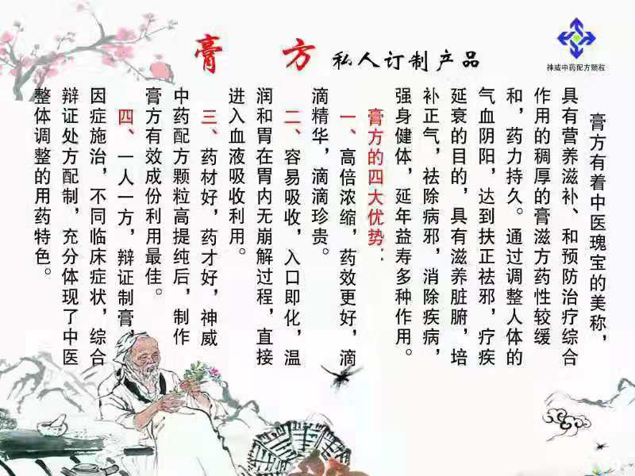
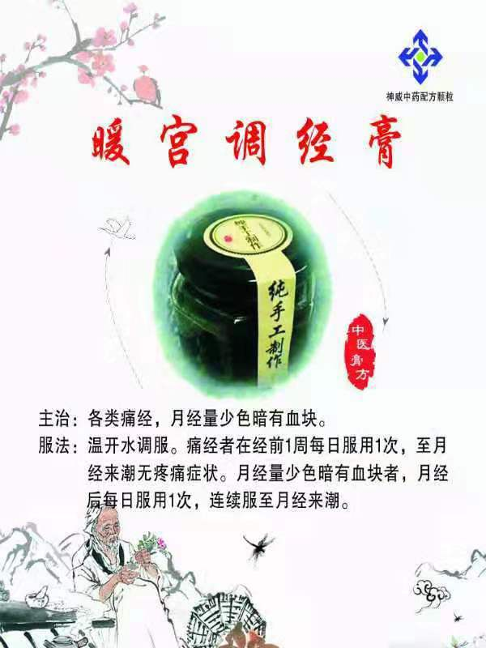
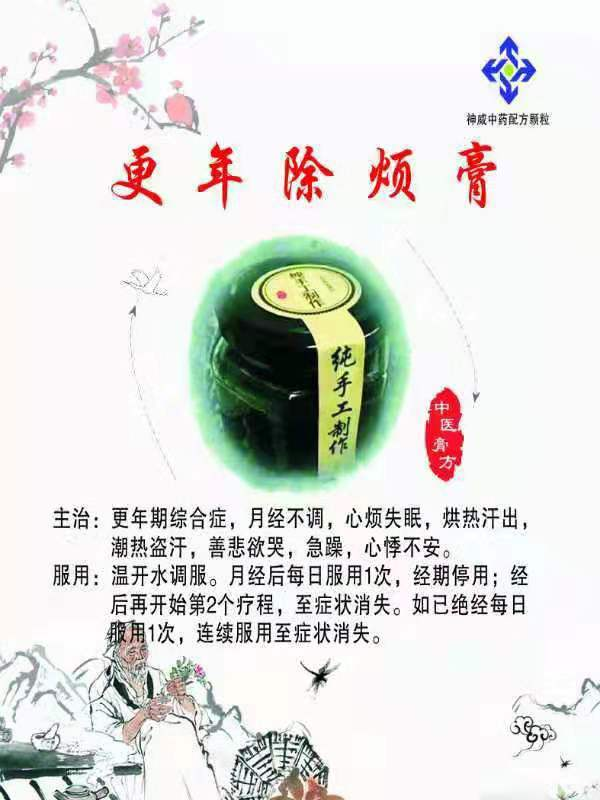
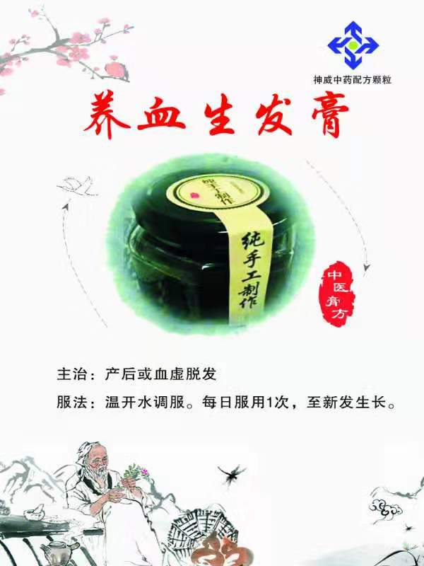
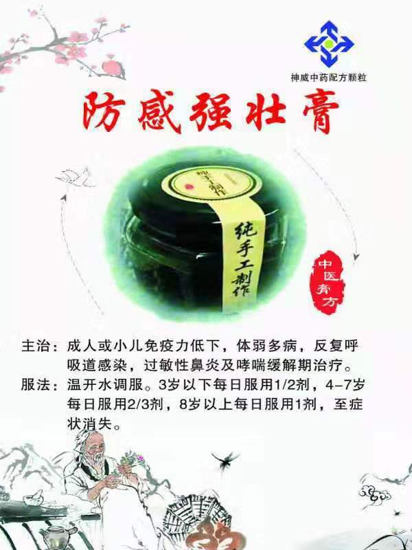
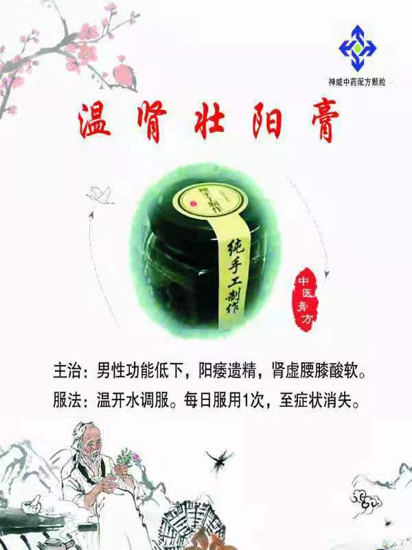
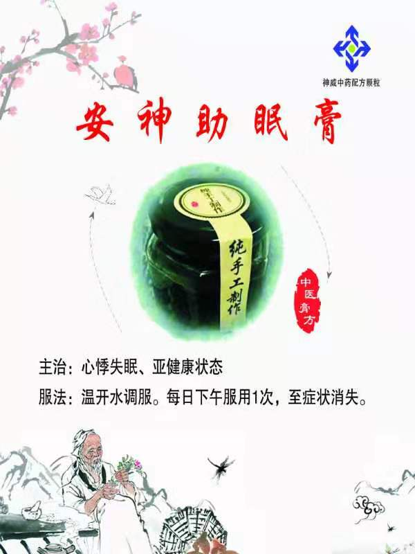
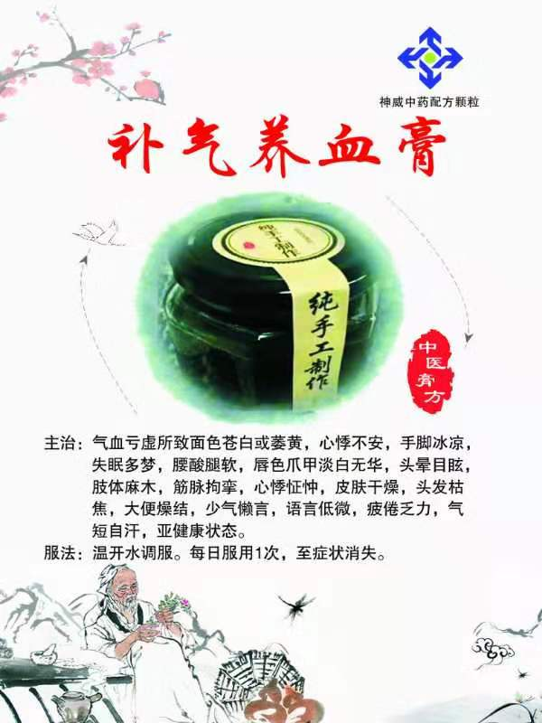

# 特色膏方(20付)

## 妇科系列

1. 暖宫调经膏 

   - 主治：各类痛经，月经量少色暗有血块。
   - 服法：温开水调服。痛经者在经前1周每日服用1次，至月经来潮无疼痛症状。月经量少色暗有血块者，月经后每日服用1次，连续服至月经来潮。

   

2. 养巢防衰膏
   - 主治：卵巢早衰，月经不调，宫寒不孕，肾虚闭经，手足怕冷，小腹冷痛，性欲低下，阴道干涩，房事疼痛，皮肤皱纹、面部色斑，面色暗哑，精神抑郁，还可用于促进产后、人流后恢复及女性35岁以后卵巢保养。
   - 服法：温开水调服。于月经后每日服用1次，经期停用。月经后再开始第2个疗程，卵巢保养隔日服用1次，经期停用。

3. 更年除烦膏

   - 主治：更年期综合征，月经不调，心烦失眠，烘热汗出，潮热盗汗，善悲欲哭，急躁，心悸不安。

   - 服法：温开水调服。月经后每日服用1次，经期停用；经后再开始第2个疗程，至症状消失。如已绝经每日服用1次，连续服用至症状消失。

     

4. 养血生发膏

   - 主治：产后或血虚脱发。

   

5. 调经消斑膏

   - 主治：气血不足，气滞血瘀所致月经不调（经量或多或少，经色或淡或暗），面部色斑（黄褐斑）者。
   - 服法：温开水调服。月经后每日服用1次，连续服至月经来潮，经期停用。

   
    

## 儿科系列

1. 小儿厌食膏
   - 主治：小儿食欲减退或消失，食量减少，营养不良，头发、毫毛色黄直立，皮肤干燥粗糙，体重下降，生长发育迟缓。
   - 服法：温开水调服。每日服用1次，至症状消失。

2. 小儿食积膏
   - 主治：小儿食积，腹部胀满，时有腹痛，夜寐不安，频频翻身蹬被，口臭，嗳气腐臭，大便干结，矢气秽臭，时有发热或手足心热。
   - 服法：温开水调服。每日服用1次。

**备注**：小儿厌食膏与小儿食积膏的区别在于：厌食膏针对脾胃气阴不足的虚证，以厌食消瘦、营养不良为主证。食积膏针对的是以食滞胃肠的实证，以食积腹胀，口臭便干为主证。请各位注意辨证用药。

3. 防感强壮膏

   - 主治：成人或小儿免疫力低下，体弱多病，反复呼吸道感染，过敏性鼻炎及哮喘缓解期治疗。
   - 服法：温开水调服。每日服用1次，至症状消失。

   

4. 益智聪明膏
   - 功效：益智聪明，增强记忆，缓解压力，消除疲劳，改善睡眠，帮助消化。
   - 服法：温开水调服，傍晚5~7点服用最佳，日一次。

5.  消化综合调理膏
   - 功效：综合调理，全面解决儿童消化问题。效果胜过斯唯诺。

6. 小儿腹痛膏
   - 功效：小儿肠系膜淋巴结炎。
   - 服法：温开水调服，每日服用1次。

7. 小儿多动症膏
   - 土虚木旺（宜补脾清肝）
   - 肝肾阴虚 肝风内动（静灵口服液配方）

8. 小儿遗尿膏（填元固堤膏）
   - 主治：小儿遗尿。
   - 服法：温开水调服。每日服用1次，至症状消失。

 

## 男科系列

1. 温肾壮阳膏

   - 主治：男性功能低下，阳痿遗精，肾虚腰膝酸软。
   - 服法：温开水调服。每日服用1次，至症状消失。

   

2. 六味地黄膏
   - 主治：头晕耳鸣，腰膝酸软，骨蒸潮热，盗汗遗精等属于肾阴亏损者。
   - 服法：每日1剂，温开水冲调

3. 补肾健脾膏
   - 主治：腰酸膝软，形寒肢冷，体虚乏力，腕腹胀满，食欲不振，女子月经不调，闭经，功能性子宫出血，男子阳痿，尿频，排尿等待，排尿无力，精少精弱不育，属于肾阳不足、脾胃亏虚。
   - 服用方法：每日1剂，温开水冲调。

 

## 通用系列

1. 安神助眠膏

   - 主治：心悸失眠、亚健康状态。
   - 服法：温开水调服。每日服用1次，至症状消失。

   

2. 补气养血膏

   - 主治：气血亏虚所致面色苍白或萎黄，心悸不安，手脚冰凉，失眠多梦，腰酸腿软，唇色爪甲淡白无华，头晕目眩，肢体麻木，筋脉拘挛，心悸怔忡，皮肤干燥，头发枯焦，大便燥结，少气懒言、语言低微、疲倦乏力、气短自汗，亚健康状态。
   - 服法：温开水调服。每日服用1次，至症状消失。

   

3. 降脂膏
   - 功效：降脂，效果胜过“血脉清”。
   - 服法：温开水调服。每日服用1次。

4. 健脾祛湿膏
   - 主治：脾虚湿热所致困倦乏力，肥胖懒动，头蒙如衰，面部油腻，面色晦暗，口中黏腻，纳谷不香，食吞腹胀，阴部潮湿，大便粘腻不爽，舌胖大有齿痕，苔白（或黄）厚腻。
   - 服法：温开水调服。每日服用1次，至症状消失。

5. 养心生脉膏
   - 主治：冠心病心绞痛，心肌梗死恢复期，低血压，心律失常，肺心病证见心悸气短，自汗，舌淡少苔，脉沉细或有结代，属于气阴两虚者。
   - 服用方法：从立冬服至大寒结束，每日1剂，温开水冲调
   - 服用方法：每日1剂，温开水冲调

6. 二仙益肾膏
   - 主治：更年期综合征月经将绝未绝，周期或前或后，经量或多或少，头眩耳鸣，腰酸乏力，两足欠温，时或怕冷，时或轰热，舌质淡，脉沉细及高血压病、肾炎、肾盂肾炎、尿路感染、闭经，属于肾阴、肾阳不足而虚火上炎者。
   - 服用方法：每日1剂，温开水冲调

7. 明目补脑膏
   - 主治：用眼过度（使用电脑、手机）、脑力透支而引起的眼睛干涩，眼肌疲劳，两目胀痛，健忘，脱发，属于肝肾精血亏虚者。
   - 服用方法：从立冬服至大寒结束，每日1剂，温开水冲调
   - 服用方法：每日1剂，温开水冲调

8. 养阴清肺膏
   - 主治：秋末冬初经常干咳不止，咳声短促，痰少黏白，或痰中带血丝，声音逐渐嘶哑，口干咽燥，午后潮热，手足心热，夜寐盗汗，口干口渴，舌红少津，脉细数，属于燥邪伤肺，肺阴亏虚者。
   - 服用方法：秋末冬初，每日1剂，温开水冲调

9. 延年益寿膏 
   - 主治：肝肾亏虚，脾肾不足。 宫廷秘方，延年益寿，增强体质，男女皆宜；亦可用于男性不育。
   - 服用方法：每日1剂，温开水冲调

10. 润燥通便膏
    - 主治：老人、产后便秘，大便干结，数日一行，排出困难，腹胀不适，属于气血亏虚，津液不足、肠道失润者。
    - 服用方法：温开水调服，每日服用1次，至症状消失。

11. 培元扶正膏
    - 主治：平素体弱多病，每遇秋冬季节反复感冒、反复发作的慢性支气管炎、哮喘、慢阻肺等久病不愈，属于肺脾肾三脏同虚者。平时也可以用于癌症术后恢复，放化疗期间调理。
    - 服用方法：温开水调服，每日服用1次

12. 通络除痹膏
    - 主治：每遇秋冬季节反复发作的风湿性关节炎、类风湿性关节炎、强直性脊柱炎等风湿免疫性疾病，证见全身关节肌肉疼痛，肢体麻木，关节肿大，屈伸不利，颈肩疼痛。肩周炎，腰腿疼痛等属于风寒湿痹者。
    - 服用方法：每日1剂，温开水冲调

13. 阴阳双补膏
    - 主治：每遇秋冬季节反复发作的慢性咳嗽、过敏性哮喘、过敏性鼻炎、慢性支气管炎、慢性阻塞性肺气肿、反复感冒、慢性皮肤病、荨麻疹、硬皮病、冻疮、闭经、痛经、宫寒不孕、阳痿、手脚冰凉等属于肾阳虚者。
    - 服用方法：每日1剂，温开水冲调

14. 温养脾胃膏
    - 主治：每遇秋冬季节反复发作的慢性胃炎、消化性溃疡等证见胃脘冷痛，喜温喜按，腹痛拘急，腹胀嗳气，泛吐清水，大便溏薄，畏寒肢冷等属于脾胃虚寒者。
    - 服用方法：每日1剂，温开水冲调。